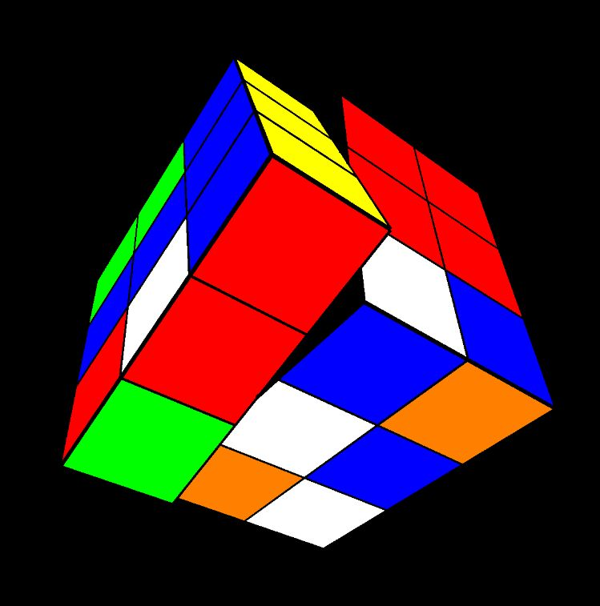
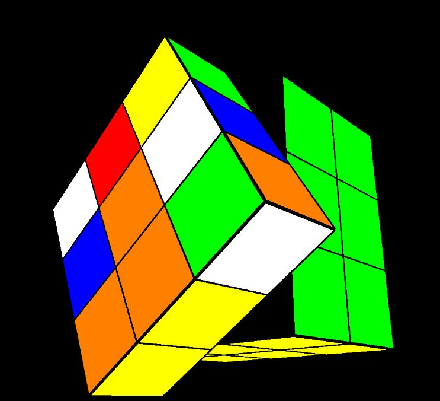

# Rubik-Cube

Visualising the Rubik's cube, with animated face rotations.
I also implemented my own method for solving it, it takes a lot more steps than even the beginner methods for humans.

This is because the Rubik's cube - as a data structure is very difficult to manage properly: even a child can recognise complicated patterns, but these are hard to implement.

By opening the index.html, you can see the cube, by pressing the 's' key, it scrambles itself and by pressing the space bar, it gradually solves itself.

